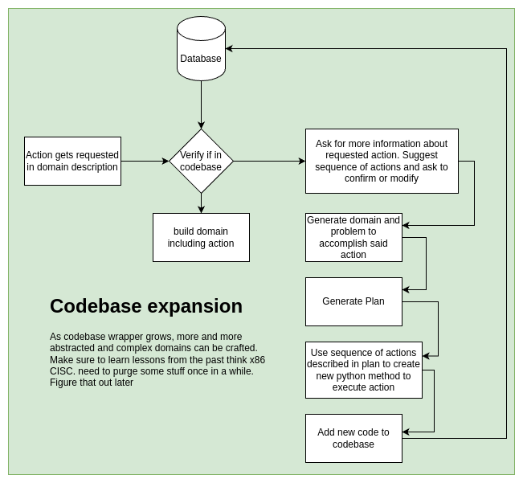

# Notes

## Prompt engineering notes

* When adding a state due to the basic reasoning of the LLM it is difficult to get it do simply add the state to the domain without having it find a logical way to modify said state(predicate).  

* In order to simplifie some tools/objects/types it has a tendency to set them as locations.  

* Need to specify that the agent must be at the same location as an object to use. 

* Added `USE_` token before the new functions so that they can be quickly identified with parsing once plan is generated

* LLM seems to have some predisposition to using common sense reasoning such as assigning the hunger state to the robot instead of simply addind it globally for the domain.

* If not is found within a precondition add the `:negative-precondition` requirement. This does not work with the POPF planner, it will make the domain valid, however will not be able to find plan. Removing the negative precondition works. As well as having 2 states on/off instead of (on) and (not (on))

* GPT-4 tends to add if statements which are not taken into account in any PDDL requirement. Reprompt

## Dynamic issues

* In order to work with dynamic objects, unseen objects, simply load them into the world and unload them as they come, declaring a set of random objects 

* As Domains get bigger consider using RAG to only extract relevant actions

## How to deal with complex tasks and actions

* When asking robot to perform a task that requires multiple actions, for example: openning a drawer, clicking a button or flipping a switch. These would be the steps to accomplishing this.

